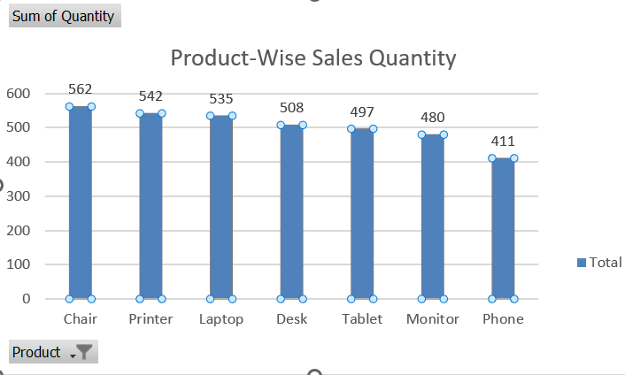
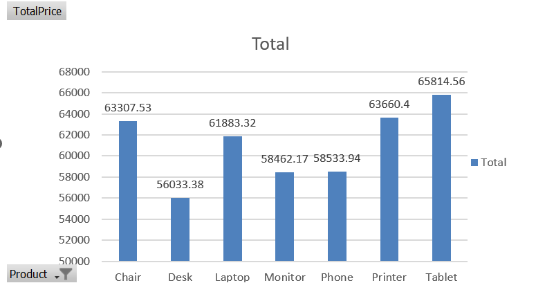
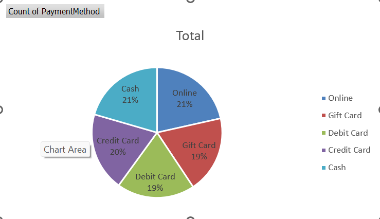

# 📊 Data Cleaning and Exploratory Data Analysis (EDA) using Excel

## 📌 Project Overview
This project focuses on performing **data cleaning** and **exploratory data analysis (EDA)** using Excel. The goal is to transform raw data into meaningful insights by identifying patterns, trends, and anomalies.

---

## 🧹 Data Cleaning Process
The dataset was cleaned to ensure accuracy and consistency:
- Handled missing values in **CouponCode**
- Removed extra spaces using `TRIM` function
- Standardized data formats
- Verified and corrected inconsistencies
- Ensured proper numerical formatting (2 decimal places)

---

## 📊 Exploratory Data Analysis (EDA)

### Key Questions Explored:
- Which product has the highest sales?
- Which product generates the highest revenue?
- Which payment method is most used?
- How frequently are coupons used?

---

## 📈 Key Insights

- 🪑 **Chair** has the highest sales → indicates strong demand  
- 💰 **Chair and Printer** generate the highest revenue  
- 💳 **Online payment** is the most preferred method  
- 🎟️ Majority of customers use coupons → high engagement with offers  

---

## 📉 Statistical Summary

| Metric | Value |
|------|------|
| Mean (Average Total Price) | 1053.97 |
| Median (Total Price) | 823.62 |
| Highest Value | 3456.40 |
| Lowest Value | 11.39 |
| Total Orders | 1200 |

### Insight:
- Mean is higher than median → data is **right-skewed**
- Presence of **high-value transactions** affects the average

---

## 📊 Visualizations

### Product-wise Sales

### Revenue Analysis

### Coupon Usage

### Payment Method Distribution

---

## 🛠️ Tools Used
- Microsoft Excel
- Pivot Tables
- Charts (Bar Chart, Pie Chart)
- Basic Statistical Functions

---

## 📁 Files Included
- `dataclean.xlsx` → Cleaned dataset with analysis
- Charts (PNG images)
- README documentation

---

## 🎯 Conclusion
The project demonstrates how Excel can be used effectively for data cleaning and EDA. Insights derived from the data can help in understanding customer behavior, improving sales strategies, and optimizing business decisions.

---

## 🚀 Internship Submission
This project is submitted as part of the **Decodelabs Internship Program**.
